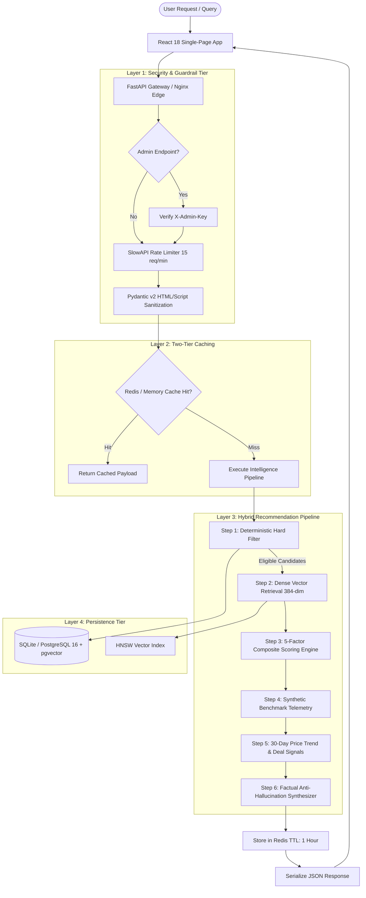
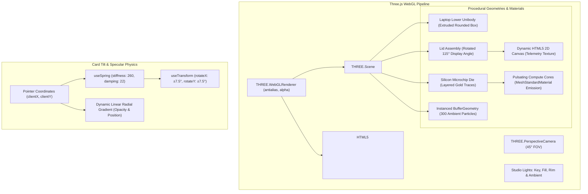

# SpecDiff Architecture & Technical Design Document

This document provides an in-depth technical analysis of the SpecDiff AI Hardware Intelligence Platform, detailing its retrieval-augmented generation (RAG) pipeline, mathematical scoring algorithms, 3D WebGL graphics layer, and multi-tier security framework.

---

## 1. High-Level Architectural Flow



---

## 2. Recommendation & Retrieval Pipeline

### Step 1: Deterministic Hard Constraint Filtering
Traditional generative AI models struggle with hard mathematical boundaries (such as never recommending a laptop that costs ₹85,001 when the budget is ₹85,000). SpecDiff enforces non-negotiable hard invariants at the SQL layer:

```sql
SELECT * FROM products
WHERE in_stock = 1
  AND price <= :max_budget
  AND ram_gb >= :min_ram_gb
  AND storage_gb >= :min_storage_gb
  AND (:category IS NULL OR category = :category)
  AND (:brand IS NULL OR brand = :brand);
```

- **Invariant 1 (Budget Cap)**: Zero budget overrun guarantee in INR ₹.
- **Invariant 2 (Capacity Floor)**: Ensures hardware meets minimum multitasking/storage prerequisites.
- **Invariant 3 (Stock Exclusion)**: Out-of-stock SKUs are eliminated before candidate scoring.

### Step 2: Dense Semantic Vector Retrieval (RAG)
For eligible candidates passing hard filtering, semantic intent is matched using dense vector embeddings:
- **Model**: `sentence-transformers/all-MiniLM-L6-v2` (384 dimensions).
- **Text Embedding String Construction**:
  ```python
  embedding_text = (
      f"{product.brand} {product.name} ({product.category}). "
      f"Processor: {product.processor}. GPU: {product.gpu}. "
      f"RAM: {product.ram_gb}GB. Storage: {product.storage_gb}GB SSD. "
      f"Display: {product.display_tech}. Battery: {product.battery_hours} hours. "
      f"Features: {product.bundled_software}. Expandability: {product.ram_expandability}. "
      f"Description: {product.description}. "
      f"Pros: {product.pros}. Cons: {product.cons}."
  )
  ```
- **Similarity Metric**: Cosine similarity normalized between $0.0$ and $1.0$:
  $$\text{Sim}(\vec{u}, \vec{v}) = \frac{\vec{u} \cdot \vec{v}}{\|\vec{u}\| \|\vec{v}\|}$$

### Step 3: 5-Factor Mathematical Scoring Formula
Candidates are ranked via a deterministic composite scoring formula:

$$S_{\text{final}} = w_1 S_{\text{req}} + w_2 S_{\text{sem}} + w_3 S_{\text{prio}} + w_4 S_{\text{rat}} + w_5 S_{\text{val}}$$

Where:
- $w_1 = 0.35$ (Requirement Adherence): Measures excess RAM, storage, and budget margin.
- $w_2 = 0.25$ (Semantic Fit): Normalized vector cosine similarity against user query.
- $w_3 = 0.20$ (User Priority Boost): Dynamically weights one of four hardware vectors:
  - `performance`: Multipliers applied to discrete GPUs and high core-count CPUs.
  - `battery`: Multipliers scaled to battery hours ($>12\text{h} \rightarrow 1.0$, $<6\text{h} \rightarrow 0.4$).
  - `portability`: Inversely proportional to chassis weight in kg.
  - `price` / `value`: Spec-to-Rupee index favoring high-capacity hardware at lower price points.
- $w_4 = 0.10$ (Verified Customer Rating): Scaled from 5-star retail reviews.
- $w_5 = 0.10$ (Value Index): Price-to-hardware ratio against market category mean.

### Step 4: Synthetic Hardware Benchmark Engine
Located in [`backend/app/services/benchmark_service.py`](file:///c:/sahityaa/RAG%20Project/backend/app/services/benchmark_service.py):
- **CPU Benchmarks**: Maps processor architectures (Apple M1–M4, Intel 12th–14th Gen, AMD Ryzen 7000/8000, Snapdragon X Elite) to Geekbench 6 (Single & Multi-Core) and Cinebench R23 scores.
- **Gaming FPS Radar**: Generates realistic resolution-calibrated framerates across four benchmark titles:
  - *Counter-Strike 2* (eSports CPU/GPU)
  - *Valorant* (High refresh CPU bound)
  - *Grand Theft Auto V* (DX11 open world)
  - *Cyberpunk 2077* (Ray-traced modern GPU load)
- **Efficiency Indices**:
  - `battery_index` (0–100): Linearized endurance mapping (4h=30, 8h=55, 12h=75, 18h=90, 24h=100).
  - `thermal_stability` (0–100): Ratio of chassis mass (`weight_kg`) to sustained battery draw.

### Step 5: 30-Day Price Tracker & Deal Signal Intelligence
Located in [`backend/app/services/price_tracker_service.py`](file:///c:/sahityaa/RAG%20Project/backend/app/services/price_tracker_service.py):
- **Deterministic Seed**: Uses `hash(product.id)` for reproducible pricing curves per SKU.
- **Indian Festival Calendar Simulation**: Synthesizes authentic pricing dips around major shopping events:
  - Amazon Great Indian Festival (Sep 25–30)
  - Flipkart Big Billion Days (Oct 5–10)
  - Diwali Mega Electronics Sale (Oct 20–25)
  - Republic Day & Independence Day Sales
- **Algorithmic Signal Classification**:
  - `STRONG_BUY`: Current street price within 5% of 30-day all-time low.
  - `WAIT_FOR_SALE`: Current street price exceeds 95% of manufacturer MSRP.
  - `FAIR_VALUE`: Standard retail market pricing.

---

## 3. 3D WebGL Graphics & Card Physics Architecture

Built with Three.js and Framer Motion in the frontend:



1. **Procedural Unibody Laptop Canvas**:
   - Zero external 3D asset downloads; constructed procedurally using native Three.js geometries to ensure 0ms load overhead.
   - Screen features an internal dynamic HTML5 2D canvas rendered as a live texture showing simulated system telemetry.
   - Mouse drag allows complete orbital inspection around the anodized metal chassis.
2. **Microchip Die Hologram**:
   - Silicon substrate with circuit trace interconnects.
   - Core blocks pulse smoothly using an animation loop modulating emissive intensity via `Math.sin(time * 3.5)`.
3. **Card Tilt Physics**:
   - Spring-damped spatial perspective transformations (`transform-style: preserve-3d`).
   - Radial specular highlight tracks cursor position across the card surface.

---

## 4. Caching & Performance Architecture

To maintain sub-15ms response times under heavy concurrent traffic, SpecDiff implements a two-tier caching strategy:

1. **Tier 1 — Distributed Redis 7**:
   - Request parameters are normalized and hashed into a deterministic SHA-256 key:
     `key = "rec:" + sha256(json_dumps(normalized_request))`
   - Standard TTL: 3600 seconds (1 hour).
   - Invalidation triggered automatically on catalog modifications.
2. **Tier 2 — In-Memory LRU / TTL Cache**:
   - Active transparently when Redis is unavailable or unconfigured.
   - Holds up to 1,000 query results with least-recently-used eviction.

---

## 5. Security & DevSecOps Architecture

1. **Role-Based Access Control (RBAC)**:
   - Administrative actions (`/api/admin/*`) require authentication with `ADMIN_API_KEY`.
   - Verified via FastAPI dependency injection before request handling.
2. **Input Sanitization & XSS Defense**:
   - Pydantic v2 validators sanitize natural language queries by stripping HTML tags, script markers, and malicious control characters.
3. **IP-Keyed Rate Limiting**:
   - Prevents volumetric denial-of-service and scraping attacks using `slowapi` sliding window counters.
