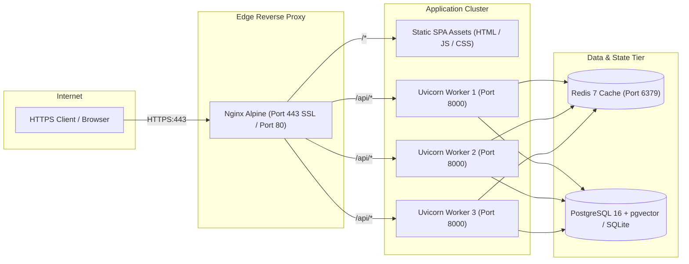

# SpecDiff Production Deployment & DevOps Guide

This guide details the deployment of the SpecDiff AI Hardware Intelligence Platform across staging and production environments using Docker, Docker Compose, Nginx, and systemd.

---

## 🏗️ Production Topology



---

## 🐳 Docker Compose Deployment (Recommended)

### 1. `docker-compose.yml`
Save the following file in the repository root:

```yaml
version: '3.8'

services:
  # 1. PostgreSQL with pgvector extension
  postgres:
    image: pgvector/pgvector:pg16
    container_name: specdiff_db
    restart: unless-stopped
    environment:
      POSTGRES_DB: specdiff
      POSTGRES_USER: specdiff_user
      POSTGRES_PASSWORD: ${DB_PASSWORD:-secure_db_password_2026}
    volumes:
      - postgres_data:/var/lib/postgresql/data
    ports:
      - "5432:5432"
    healthcheck:
      test: ["CMD-SHELL", "pg_isready -U specdiff_user -d specdiff"]
      interval: 10s
      timeout: 5s
      retries: 5

  # 2. Redis Cache
  redis:
    image: redis:7-alpine
    container_name: specdiff_redis
    restart: unless-stopped
    command: redis-server --appendonly yes --requirepass ${REDIS_PASSWORD:-secure_redis_password_2026}
    volumes:
      - redis_data:/data
    ports:
      - "6379:6379"
    healthcheck:
      test: ["CMD", "redis-cli", "ping"]
      interval: 10s
      timeout: 5s
      retries: 5

  # 3. FastAPI Backend
  backend:
    build:
      context: ./backend
      dockerfile: Dockerfile
    container_name: specdiff_backend
    restart: unless-stopped
    environment:
      - DATABASE_URL=postgresql://specdiff_user:${DB_PASSWORD:-secure_db_password_2026}@postgres:5432/specdiff
      - REDIS_URL=redis://:${REDIS_PASSWORD:-secure_redis_password_2026}@redis:6379/0
      - ADMIN_API_KEY=${ADMIN_API_KEY:-specdiff_prod_admin_key_2026}
      - GEMINI_API_KEY=${GEMINI_API_KEY:-}
      - RATE_LIMIT_PER_MINUTE=30/minute
    depends_on:
      postgres:
        condition: service_healthy
      redis:
        condition: service_healthy
    ports:
      - "8000:8000"

  # 4. Frontend SPA + Nginx Reverse Proxy
  frontend:
    build:
      context: ./frontend
      dockerfile: Dockerfile
    container_name: specdiff_frontend
    restart: unless-stopped
    ports:
      - "80:80"
      - "443:443"
    depends_on:
      - backend
    volumes:
      - ./certbot/conf:/etc/letsencrypt
      - ./certbot/www:/var/www/certbot

volumes:
  postgres_data:
  redis_data:
```

---

### 2. Backend Dockerfile (`backend/Dockerfile`)

```dockerfile
FROM python:3.11-slim

WORKDIR /app

# Install build dependencies
RUN apt-get update && apt-get install -y --no-install-recommends \
    build-essential \
    curl \
    && rm -rf /var/lib/apt/lists/*

# Install Python requirements
COPY requirements.txt .
RUN pip install --no-cache-dir --upgrade pip && \
    pip install --no-cache-dir -r requirements.txt

# Copy backend source code
COPY . .

# Run as unprivileged user
RUN useradd -m appuser && chown -R appuser:appuser /app
USER appuser

EXPOSE 8000

CMD ["uvicorn", "app.main:app", "--host", "0.0.0.0", "--port", "8000", "--workers", "4"]
```

---

### 3. Frontend Dockerfile (`frontend/Dockerfile`)

```dockerfile
# Stage 1: Build React SPA
FROM node:20-alpine AS build

WORKDIR /app

COPY package*.json ./
RUN npm ci

COPY . .
RUN npm run build

# Stage 2: Serve with Nginx Alpine
FROM nginx:alpine

# Copy custom Nginx configuration
COPY nginx.conf /etc/nginx/conf.d/default.conf

# Copy production static build
COPY --from=build /app/dist /usr/share/nginx/html

EXPOSE 80
EXPOSE 443

CMD ["nginx", "-g", "daemon off;"]
```

---

### 4. Nginx Reverse Proxy Configuration (`frontend/nginx.conf`)

```nginx
server {
    listen 80;
    server_name specdiff.in www.specdiff.in;

    # Gzip Compression
    gzip on;
    gzip_vary on;
    gzip_min_length 1024;
    gzip_proxied any;
    gzip_types text/plain text/css text/xml application/json application/javascript application/xml+rss application/atom+xml image/svg+xml;

    # Static Assets with Long-Term Caching
    location ~* \.(?:css|js|woff2?|svg|png|jpg|jpeg|gif|ico|webp)$ {
        root /usr/share/nginx/html;
        expires 1y;
        add_header Cache-Control "public, immutable";
        access_log off;
    }

    # API Gateway Reverse Proxy
    location /api/ {
        proxy_pass http://backend:8000/api/;
        proxy_http_version 1.1;
        proxy_set_header Upgrade $http_upgrade;
        proxy_set_header Connection 'upgrade';
        proxy_set_header Host $host;
        proxy_set_header X-Real-IP $remote_addr;
        proxy_set_header X-Forwarded-For $proxy_add_x_forwarded_for;
        proxy_set_header X-Forwarded-Proto $scheme;
        proxy_cache_bypass $http_upgrade;
        proxy_read_timeout 60s;
    }

    # SPA Client Routing Fallback
    location / {
        root /usr/share/nginx/html;
        index index.html;
        try_files $uri $uri/ /index.html;
    }
}
```

---

## 🚀 Execution & Management Commands

### Start All Services:
```bash
docker compose up -d --build
```

### Check Logs:
```bash
# View backend logs in real-time
docker compose logs -f backend

# View reverse proxy access logs
docker compose logs -f frontend
```

### Seed Catalog in Production Container:
```bash
docker compose exec backend python data/seed_expanded_catalog.py
```

### Stop Services:
```bash
docker compose down
```

---

## 🔒 Production Security Checklist

- [ ] Change default `ADMIN_API_KEY` to a cryptographically secure 64-character token.
- [ ] Configure HTTPS via Let's Encrypt / Certbot with automated renewal.
- [ ] Ensure Redis is password-protected and not exposed to the public internet.
- [ ] Enable PostgreSQL SSL mode (`sslmode=require`).
- [ ] Set `RATE_LIMIT_PER_MINUTE` appropriately based on expected visitor load.
