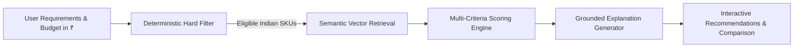

# SmartPick: Product Requirements Document (PRD) - Indian Market Edition

**Document Version:** 1.0  
**Status:** Approved for MVP Development  
**Date:** September 13, 2026  
**Product Name:** SmartPick (Laptops India)  
**Target Market:** Indian Consumer Laptop Market (Retail / E-Commerce)  
**Currency Standard:** Indian Rupee (INR - ₹)  
**Target Delivery:** 1-Week MVP  

---

## 1. Executive Summary

**SmartPick** is an AI-powered, hybrid recommendation engine tailored specifically to the **Indian consumer laptop market**. Shopping for laptops in India involves complex trade-offs across strict price segments (e.g., under ₹40k, ₹40k–₹65k, ₹65k–₹85k, ₹85k–₹1.2L, and ₹1.2L+). Indian buyers—ranging from engineering/GATE students and civil service aspirants to IT professionals and content creators—frequently struggle with confusing processor tiers, ambiguous GPU wattages, soldered versus upgradeable RAM, and the high cost of separate software licenses like Microsoft Office.

Generic e-commerce filters (Amazon.in, Flipkart) fail to capture natural workflows (such as *"coding laptop for CSE student with upgradeable RAM that runs Linux and stays cool in summer"*), while general conversational AI tools (like ChatGPT) hallucinate US prices, obsolete SKUs, or models not officially serviced in India.

SmartPick solves this through a **Hybrid RAG (Retrieval-Augmented Generation) Architecture**:
1. **Deterministic Hard Filtering:** Invariant checks ensuring no product exceeds the user's budget in INR (₹), falls below required RAM/SSD capacity, or is out of stock in India.
2. **Semantic Retrieval:** Dense vector embeddings matching colloquial Indian use cases (*"college library study"*, *"coding in Docker & VS Code"*, *"budget gaming Valorant"*, *"video editing under 1 Lakh"*).
3. **Multi-Factor Scoring & Ranking:** Mathematical composite score balancing requirement adherence, semantic fit, user priority, customer ratings, and spec-to-rupee value.
4. **Grounded Explanation Generation:** Plain-language rationales citing verified catalog attributes, explicit RAM upgradeability status, MS Office inclusion, and honest thermal/port trade-offs.
5. **Direct Side-by-Side Comparison:** 2 or 3 laptops compared head-to-head with Indian market street pricing and priority winner highlights.

---

## 2. Indian Market Problem Statement

### 2.1 The Indian Buyer Problem
1. **Strict Psychological Price Brackets:** In India, laptop purchasing is heavily bracketed by clear psychological price caps:
   * **₹30,000 – ₹45,000 (Entry / Student / Daily Use):** Schoolwork, web browsing, basic coding.
   * **₹45,000 – ₹70,000 (Mainstream College / Coding / Multitasking):** Engineering students, junior developers, multitasking office work.
   * **₹65,000 – ₹85,000 (Entry/Mid Gaming & Creator):** Discrete GPU (RTX 3050/4050), CAD, high refresh rate screens.
   * **₹80,000 – ₹1,25,000 (Premium Ultrabook / Mobile Professional):** Lightweight (<1.3kg), 12+ hour battery, OLED/Retina displays (MacBook Air, Zenbook, Galaxy Book).
   * **₹1,25,000 – ₹2,50,000+ (Flagship Workstations & Enthusiast Gaming):** High-TDP gaming, 3D rendering, machine learning.
2. **Crucial Indian Buying Factors Ignored by Generic Search:**
   * **RAM Expandability:** In India, buyers strongly favor laptops with an open SO-DIMM slot for future upgradeability to extend device longevity.
   * **Bundled MS Office:** Genuine MS Office Home & Student (Lifetime) saves ₹7,000–₹9,000, which is a major purchase trigger.
   * **Thermal Performance & Battery Endurance:** Frequent travel, power cuts, and hot room environments make battery efficiency and cool thermals critical.
3. **Hallucination & Currency Mismatch in General AI:** General LLMs often quote US dollar pricing converted at nominal exchange rates without factoring in Indian import duties (GST, customs), recommending SKUs not sold in India or citing configurations that cost 30% more locally.

---

## 3. Product Vision & Success Metrics

### 3.1 Product Vision
To be the most trustworthy, accurate, and transparent laptop advisory engine in India, empowering students, professionals, and gamers to find their ideal device at genuine Indian market street prices with zero speculative hallucination.

### 3.2 Product Objectives & Key Results (OKRs)

* **Objective 1: Absolute Precision on Indian Budget & Specs**
  * *KR 1.1:* 100% compliance on budget ceiling in INR (₹) and minimum hardware floors.
  * *KR 1.2:* Zero out-of-stock or non-Indian SKUs recommended.
* **Objective 2: Verified Grounding & Local Nuances**
  * *KR 2.1:* $\ge 90\%$ of explanation points backed by catalog metadata (including RAM expandability and bundled software).
  * *KR 2.2:* 100% of no-match scenarios provide intelligent relaxation guidance calibrated in Indian Rupees.
* **Objective 3: Low Latency & High Responsiveness**
  * *KR 3.1:* Recommendation latency under 5.0 seconds.
  * *KR 3.2:* Side-by-side comparison under 3.0 seconds.

---

## 4. User Personas (Indian Market)

| Persona | "Arjun" (B.Tech CS Student) | "Ananya" (UPSC / CA Aspirant) | "Kavita" (Corporate Consultant) | "Rohit" (Catalog Manager) |
| :--- | :--- | :--- | :--- | :--- |
| **Location & Context** | Tier-1/Tier-2 Engineering College. | Delhi / Mukherjee Nagar / Home Library. | Bengaluru / Gurugram IT corridor, hybrid WFH. | E-commerce Store Manager in Mumbai. |
| **Budget & Constraints**| Max ₹65,000, 16GB RAM, SSD, upgradable RAM. | Max ₹55,000, 10+ hr battery, anti-glare screen. | Max ₹1,10,000, weight $< 1.3\text{ kg}$, premium look. | High volume CSV catalog imports, price updates. |
| **Primary Workflow** | Python, Docker, Linux dual-boot, casual Valorant. | Reading 500-page PDFs, Zoom lectures, MS Word. | Multi-tab Excel, Teams calls, travel in airports. | Fast batch updates, stock toggles, error logs. |
| **SmartPick Value** | Finds highest spec-to-price ratio with upgradable RAM. | Recommends silent, long-battery laptops with eye-care screen. | Prioritizes thin & light ultrabooks with verified battery life. | Clear CSV validation report with line-number errors. |

---

## 5. Scope & Features (Indian Market MVP)

### Feature 1: Indian Market Recommendation Form
* **Currency:** Displayed in INR (₹) with Indian Lakhs/Thousands formatting (`₹45,000`, `₹1,14,990`).
* **Budget Slider / Input:** Range from ₹25,000 to ₹2,50,000 with quick-select price chips (*Under ₹40k*, *₹40k–₹65k*, *₹65k–₹85k*, *₹85k–₹1.2L*, *Above ₹1.2L*).
* **RAM & Storage Floor:** Single-select pills (`8 GB`, `16 GB`, `32 GB`, `64 GB` / `256 GB`, `512 GB`, `1 TB`, `2 TB`).
* **Intended Use Description:** Free-text prompt (*"e.g., Engineering student at NIT, coding in Python and VS Code, runs AutoCAD, plays Valorant, needs good cooling"*).
* **Brand Filter (Optional):** Popular Indian retail brands: `Any`, `Lenovo`, `ASUS`, `HP`, `Dell`, `Apple`, `Acer`, `Samsung`.
* **Primary Priority:** `Best Overall Value`, `Performance`, `Battery Life`, `Portability (Weight)`, `Lowest Price`.

### Feature 2: Strict Deterministic Hard Filtering
* Rejects any laptop exceeding user's maximum budget in ₹.
* Rejects any laptop below minimum RAM or Storage.
* Excludes out-of-stock laptops.
* Zero tolerance: No LLM hallucination can override these filters.

### Feature 3: Semantic Retrieval & Embeddings
* Matches qualitative descriptions against comprehensive Indian catalog chunks detailing thermal behavior, display quality (anti-glare, nits), keyboard feel, and intended workloads.
* Query vector embedding compared against catalog vectors via bounded cosine similarity.

### Feature 4: Multi-Factor Scoring Engine
* **Formula:**
  $$\text{FinalScore} = 0.35 \cdot S_{\text{req}} + 0.25 \cdot S_{\text{sem}} + 0.20 \cdot S_{\text{prio}} + 0.10 \cdot S_{\text{rat}} + 0.10 \cdot S_{\text{val}}$$
* **Value for Money ($S_{\text{val}}$):** Spec metric per thousand rupees normalized against Indian market averages.

### Feature 5: Grounded Explanations with Local Metadata
* Bulleted reasons explaining why the laptop matches budget and use case.
* Honest trade-offs from catalog cons (e.g. *"TDP limited to 45W"*, *"Soldered RAM cannot be upgraded past 16GB"*, *"Display is 250 nits, best indoors"*).
* Highlights Indian buying bonuses: *"Includes Lifetime MS Office Home & Student 2021"*, *"1 Free SO-DIMM Slot Available for RAM expansion"*.

### Feature 6: Side-by-Side Comparison Matrix
* 2 or 3 laptops compared across Price (₹), Processor, GPU, RAM, Storage, Battery Hours, Weight (kg), RAM Expandability, MS Office Inclusion, and Rating.
* Highlights the winner for the active priority (e.g. "Longest Battery: Apple MacBook Air M2", "Best Value: Lenovo IdeaPad Slim 3").

### Feature 7: Admin Catalog Management & CSV Ingestion
* Bulk CSV upload supporting 40+ Indian laptop SKUs.
* Validates prices in ₹, hardware fields, and reports invalid rows with specific line numbers.
* Instant toggle for product stock status.

### Feature 8: User Feedback & Audit Logs
* Thumbs up / Thumbs down feedback with optional comments.
* Persists user queries and recommendations with timestamp and latency.

---

## 6. Risk Management & Indian Market Mitigations

| Risk | Impact | Indian Market Mitigation |
| :--- | :---: | :--- |
| **Price Volatility (Festive Sales e.g., Big Billion Days / Great Indian Festival)** | High | Display clear `catalog_updated_at` date; provide simple admin CSV upload to refresh prices in seconds. |
| **Soldered RAM Disappointment** | Medium | Explicitly display `ram_expandability` badge on every card and comparison row. |
| **Unrealistic Constraints (e.g. 32GB RAM under ₹40,000)** | Medium | Diagnostic solver explains the gap in INR and recommends realistic Indian market minimum pricing. |
| **LLM API Outage or Latency** | High | Instant fallback to deterministic template synthesizer citing factual catalog values with zero latency and 100% reliability. |
