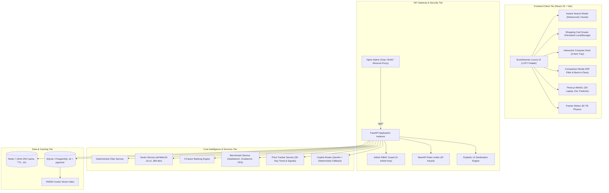

# SpecDiff — AI Hardware Intelligence & Electronic Recommendation Platform

> *"Skill issue? Nah, spec diff."*

[](https://www.python.org/)
[](https://fastapi.tiangolo.com/)
[](https://reactjs.org/)
[](https://threejs.org/)
[](https://vitejs.dev/)
[](https://tailwindcss.com/)
[-brightgreen.svg?logo=pytest&logoColor=white)](backend/tests/)
[-orange.svg)](#)
[](LICENSE.md)

**SpecDiff** is an enterprise-grade, AI-powered hardware recommendation and comparison platform built specifically for the **Indian consumer electronics market (INR ₹)**. It bridges the divide between rigid, faceted e-commerce filters (Amazon India, Flipkart) and hallucinating LLM chatbots by fusing:

1. **Deterministic hard constraints** (0% budget overshoot, strict RAM/storage capacity, stock availability).
2. **Dense semantic vector retrieval (RAG)** (384-dimensional cosine similarity via `all-MiniLM-L6-v2`).
3. **5-factor multi-criteria ranking algorithm** (spec fit, semantic affinity, priority weighting, ratings, value-for-money).
4. **Hardware benchmark & 30-day price trend intelligence** (Geekbench 6, Cinebench R23, Gaming FPS, festival discount signals).
5. **Interactive 3D WebGL hardware visualizers** (procedural unibody laptop canvas, microchip die hologram, ambient particle constellation).
6. **Instant multi-category electronics search engine** with dynamic category facets.
7. **Persistent shopping cart system** with coupon discount engine (`SPECDIFF5`, `DIWALI10`).

---

## 📸 Platform Highlights

```
┌────────────────────────────────────────────────────────────────────────────────────────┐
│  SPEC-DIFF   CONFIGURATOR   COLLECTION   CATALOG   ADMIN  │ 🇮🇳 INDIA • VERIFIED STREET  │
│                                           [🔍 Search] [✨ Copilot] [🛒 CART (2)] [COMPARE] │
├────────────────────────────────────────────────────────────────────────────────────────┤
│  ⚡ PROCEDURAL 3D LAPTOP CANVAS (Three.js PBR Metallic Studio Canvas)                 │
│  ✨ 3D MICROCHIP DIE HOLOGRAM (Pulsating Compute Cores & Gold Interconnects)           │
│  🔍 INSTANT SEARCH ENGINE (113+ SKUs across 8 categories with live facet count chips) │
│  🛒 GLOBAL SHOPPING CART DRAWER (Persistent LocalStorage + Indian Festive Coupons)    │
│  📊 SCANDINAVIAN LUXURY COMPARISON ENGINE (Floating Dock + Best-in-Class Spec Matrix)  │
│  📈 30-DAY PRICE INTELLIGENCE (Diwali / BBD Sale Dips + Deal Signals)                  │
└────────────────────────────────────────────────────────────────────────────────────────┘
```

---

## 🌟 Key Features

### 1. 🇮🇳 113+ Verified Indian Electronic Products Across 8 Categories
A comprehensive catalog seeded with verified Indian retail street pricing across **Amazon India, Flipkart, Croma, Reliance Digital, and official brand stores**:
- **Laptops (41 items)**: Apple MacBook Pro M3 Max, Lenovo Legion Pro 7i, ThinkPad P16v, Dell XPS 16, ROG Zephyrus G16, Acer Swift Go 14.
- **Smartphones (23 items)**: iPhone 16 Pro Max, Pixel 9 Pro Fold, Galaxy S24 Ultra, OnePlus Open, Vivo X100 Pro.
- **Audio & Headphones (10 items)**: Sony WH-1000XM5, Sennheiser Momentum 4, Bose QuietComfort Ultra, AirPods Max USB-C.
- **Smartwatches & Wearables (10 items)**: Apple Watch Ultra 2, Garmin Fenix 7 Pro Solar, Galaxy Watch Ultra, OnePlus Watch 2.
- **Tablets (9 items)**: iPad Pro 13" M4 OLED, Galaxy Tab S9 Ultra, iPad Air 11" M2, Xiaomi Pad 6 Max.
- **Monitors & Displays (8 items)**: LG UltraGear 32GS95UE 4K Dual-Hz OLED, Samsung Odyssey Neo G9 (57" Dual UHD), BenQ PD3220U.
- **Gaming Consoles & Handhelds (6 items)**: Sony PlayStation 5 Slim (Disc & Digital), Microsoft Xbox Series X 1TB, ASUS ROG Ally X, Steam Deck OLED.
- **Keyboards & Peripherals (6 items)**: Keychron Q1 Pro Wireless, Logitech MX Master 3S, Razer Huntsman V3 Pro, Apple Magic Keyboard.

### 2. 🔍 Instant Multi-Category Electronic Search Engine
- **Debounced Instant Search**: Sub-second full-text queries querying across name, brand, processor, GPU, display, pros, and cons.
- **Dynamic Category Count Pills**: Live item counts directly aggregated from the backend database.
- **Budget Presets**: Single-click filters for `Under ₹30,000`, `₹30K - ₹60K`, `₹60K - ₹1.2L`, and `Above ₹1.2L`.
- **Card Action Bar**: Every search card features instant `+ Cart`, `Comp` (compare), and `Deal` (retailer) buttons.
- **Trending Discoveries**: Instant clickable search prompts for high-demand hardware.

### 3. 🛒 Persistent Shopping Cart System
- **Persistent State**: Synced with `localStorage` (`specdiff_cart_v2`) across sessions and reloads.
- **Interactive Cart Drawer**: Framer Motion slide-out drawer with quantity modifiers (`+`/`-`), single-click trash removal, and clear cart.
- **Coupon Engine**:
  - `SPECDIFF5`: 5% VIP Hardware Discount
  - `DIWALI10`: 10% Festive Sale Discount
- **Price Transparency**: Automatic street-price savings vs. approximate MRP and grand total calculation.
- **Ubiquitous "+ Cart" Integration**: Add to cart from Recommendation Cards, Search Engine, Catalog Table, Spotlight Banner, and Comparison Matrix.

### 4. 🎮 3D WebGL Hardware Visualizers
- **Interactive 3D Unibody Laptop Canvas**: Procedural Three.js laptop with anodized metal unibody, angled display lid, dynamic telemetry canvas screen, studio three-point lighting, and mouse orbit drag controls.
- **3D Silicon Microchip Die Hologram**: Golden wire interconnects with pulsating neon compute cores visualizing multi-core CPU architecture.
- **Ambient 3D Particle Constellation**: Floating 3D particle grid with mouse parallax depth-of-field in the hero banner.
- **3D Perspective Card Tilt**: Physics-based spring-damped card rotation (`rotateX`/`rotateY`) with dynamic holographic specular sheen.

### 5. ⚖️ 5-Factor Hybrid Ranking Algorithm
Recommendations are scored mathematically using deterministic invariants and multi-criteria weighting:

$$S_{\text{final}} = 0.35 \cdot S_{\text{req}} + 0.25 \cdot S_{\text{sem}} + 0.20 \cdot S_{\text{prio}} + 0.10 \cdot S_{\text{rat}} + 0.10 \cdot S_{\text{val}}$$

- **100% Deterministic Constraint Invariants**: No machine exceeding user budget in ₹, falling below minimum RAM/SSD, or marked out-of-stock is ever recommended.
- **Grounded Anti-Hallucination Synthesizer**: Citations drawn directly from verified catalog specs with zero LLM hallucinations.
- **Diagnostic Relaxation Guidance**: When constraints yield 0 matches (e.g., ₹35K budget for 32GB RAM), the engine analyzes bottleneck dimensions and prescribes minimum INR budget increases.

### 6. 📊 Scandinavian Luxury LOFY Comparison Engine
- **Floating Compare Dock**: Sticky bottom dock tracking up to 3 selected items with quick removal chips and diff counter.
- **Three Switchable Comparison Views**:
  1. **Spec Matrix**: Side-by-side technical specs with **"Highlight Differences Only"** toggle and automated **"Best-in-Class"** badges (Best Price, Max RAM, Max Storage, Longest Battery, Lightest).
  2. **3D & Benchmarks**: Geekbench 6 single/multi, Cinebench R23, and FPS radar charts alongside 3D microchip die.
  3. **Price Intelligence**: 30-day historical price graphs and deal signals (`STRONG_BUY`, `FAIR_VALUE`, `WAIT_FOR_SALE`).

### 7. 🛡️ Production-Grade Security & Performance Architecture
- **Admin RBAC Authentication**: Endpoints under `/api/admin/*` protected via `X-Admin-Key` header with 401 Unauthorized rejection.
- **Rate Limiting**: Integrated `slowapi` rate limiter restricting client IPs to 15 requests/minute.
- **Pydantic v2 Defense**: Input validation and HTML/script sanitization blocking XSS and injection attacks.
- **SHA-256 Redis Caching**: Two-tier caching with Redis 7 and automatic in-memory LRU/TTL fallback.
- **Asynchronous CSV Processing**: Background batch catalog upload with unique Job IDs, line-by-line validation, and error quarantine.

---

## 🏗️ System Architecture



---

## 📂 Repository Layout

```
RAG Project/
├── backend/
│   ├── app/
│   │   ├── main.py                   # FastAPI application entrypoint & middleware
│   │   ├── config.py                 # Configuration settings (Admin key, Redis, weights)
│   │   ├── database.py               # SQLite / PostgreSQL engine with WAL mode
│   │   ├── models.py                 # SQLAlchemy models (Product, RecommendationLog, Feedback, ClickLog)
│   │   ├── schemas.py                # Pydantic validation schemas & request models
│   │   ├── routers/
│   │   │   ├── recommend.py          # POST /api/recommend (5-factor ranking)
│   │   │   ├── compare.py            # POST /api/compare (side-by-side matrix & telemetry)
│   │   │   ├── products.py           # GET /api/products (search, filters, facets), PATCH stock
│   │   │   ├── copilot.py            # POST /api/copilot (interactive hardware advisor)
│   │   │   ├── admin.py              # POST /api/admin/catalog/upload, reindex, health
│   │   │   └── feedback.py           # POST /api/feedback & click telemetry
│   │   └── services/
│   │       ├── filter_service.py     # Deterministic hard constraint invariants
│   │       ├── vector_service.py     # 384-dimensional dense semantic vector retrieval
│   │       ├── ranking_service.py    # 5-factor mathematical composite scoring
│   │       ├── benchmark_service.py  # CPU & GPU synthetic benchmark profiles
│   │       ├── price_tracker_service.py # 30-day price trend & Indian festival signals
│   │       ├── cache_service.py      # Two-tier Redis & in-memory caching engine
│   │       ├── relaxation_service.py # Diagnostic relaxation advice
│   │       └── catalog_service.py   # Async CSV validator with error quarantine
│   ├── data/
│   │   ├── laptops_india_catalog.csv # Verified Indian catalog
│   │   ├── seed_db.py                # Initial database seed script
│   │   └── seed_expanded_catalog.py  # 113-product electronics expansion seeder
│   ├── tests/
│   │   ├── test_filters.py           # Invariant validation tests (TC-001 - TC-004)
│   │   ├── test_ranking.py           # Monotonicity & priority weighting tests
│   │   ├── test_platform_upgrade.py  # Benchmark, price signal & copilot tests
│   │   ├── test_production_modules.py# RBAC, Rate limiting, sanitization & caching tests
│   │   ├── test_csv_upload.py        # CSV quarantine & error reporting tests
│   │   └── test_rag_benchmark.py     # 20 Golden Indian Market Benchmark Personas
│   ├── pytest.ini                    # Pytest configuration & warning filters
│   └── requirements.txt              # Backend Python dependencies
│
├── frontend/
│   ├── src/
│   │   ├── App.jsx                   # Central React application coordinator
│   │   ├── main.jsx                  # React DOM root entrypoint
│   │   ├── index.css                 # Global Scandinavian LOFY styling & typography
│   │   ├── components/
│   │   │   ├── Header.jsx            # Top navbar with Search, Copilot, Cart & Compare
│   │   │   ├── HeroBanner.jsx        # Scandinavian banner with 3D Canvas & Particles
│   │   │   ├── Laptop3DCanvas.jsx    # Procedural Three.js 3D WebGL unibody laptop
│   │   │   ├── ParticleConstellation3D.jsx # 3D ambient particle constellation
│   │   │   ├── Benchmark3DVisualizer.jsx # 3D silicon microchip die hologram
│   │   │   ├── SearchEngineModal.jsx # Instant electronic search engine with facets
│   │   │   ├── CartDrawer.jsx        # Persistent shopping cart drawer with coupon engine
│   │   │   ├── RecommendationForm.jsx# Dynamic configurator with budget & priorities
│   │   │   ├── ProductCard.jsx       # 3D tilted card with specular glare & +Cart action
│   │   │   ├── CompareDock.jsx       # Sticky floating comparison dock
│   │   │   ├── ComparisonModal.jsx   # Side-by-side spec matrix with diff highlighting
│   │   │   ├── BenchmarkVisualizer.jsx # Recharts CPU, GPU Radar, and 3D Die tabs
│   │   │   ├── PriceHistoryChart.jsx # 30-day historical price chart & deal badge
│   │   │   ├── CatalogBrowser.jsx    # Filterable catalog browser with 8 category tabs
│   │   │   ├── AdminDashboard.jsx    # Secure catalog upload, quarantine & stock toggle
│   │   │   ├── AICopilotDrawer.jsx   # Interactive AI hardware advisor
│   │   │   ├── CommandPalette.jsx    # Global Ctrl+K command palette
│   │   │   ├── DecisionDossierModal.jsx # Printable hardware dossier export
│   │   │   └── ToastNotification.jsx # Accessible, non-blocking toast notifications
│   │   ├── services/
│   │   │   └── api.js                # TanStack Query & REST API client
│   │   └── utils/
│   │       ├── dealUrl.js            # Outbound affiliate & retailer deep link builder
│   │       └── formatters.js         # Indian Rupee currency & hardware formatters
│   ├── package.json                  # Frontend dependencies & scripts
│   ├── vite.config.js                # Vite build configuration & API proxy
│   └── tailwind.config.js            # Scandinavian LOFY theme colors & typography
│
├── PRD.md                            # Product Requirements Document
├── SRS.md                            # Software Requirements Specification
├── API.md                            # Complete REST API Reference Documentation
├── ARCHITECTURE.md                   # Technical Architecture & Pipeline Deep Dive
├── DEPLOYMENT.md                     # Production DevOps, Docker & Nginx Deployment Guide
├── CONTRIBUTING.md                   # Development, Coding Standards & PR Guidelines
├── CHANGELOG.md                      # Release History & Version Changelog
├── LICENSE.md                        # MIT License
└── README.md                         # Project Overview & Quickstart Guide (this file)
```

---

## 🚀 Quick Start Guide

### Prerequisites
- **Python**: 3.11 or later (tested on 3.13)
- **Node.js**: v18.0 or later (tested on v22.0)
- **Git**: For source version control
- *(Optional)* **Redis 7**: For distributed production caching (in-memory fallback active by default)

### 1. Backend Setup
```bash
# Navigate to backend directory
cd backend

# Create virtual environment
python -m venv venv

# Activate virtual environment
# Windows (PowerShell):
.\venv\Scripts\Activate.ps1
# macOS/Linux:
source venv/bin/activate

# Install dependencies
pip install -r requirements.txt

# Seed database with 113 electronics products & 384-dim vector embeddings
python data/seed_expanded_catalog.py

# Start FastAPI server on port 8000 with auto-reload
uvicorn app.main:app --host 127.0.0.1 --port 8000 --reload
```
- **Backend Health Check**: [http://127.0.0.1:8000/api/health](http://127.0.0.1:8000/api/health)
- **Interactive Swagger Docs**: [http://127.0.0.1:8000/docs](http://127.0.0.1:8000/docs)
- **ReDoc Documentation**: [http://127.0.0.1:8000/redoc](http://127.0.0.1:8000/redoc)

### 2. Frontend Setup
In a new terminal window:
```bash
# Navigate to frontend directory
cd frontend

# Install npm packages
npm install

# Start Vite dev server on port 5173
npm run dev
```
- **Web Application UI**: [http://localhost:5173](http://localhost:5173)

---

## ⚙️ Configuration & Environment Variables

Configure environment variables in a `.env` file in the `backend/` directory:

| Variable | Default Value | Description |
| :--- | :--- | :--- |
| `ADMIN_API_KEY` | `specdiff_admin_secret_key_2026` | Secret key securing all `/api/admin/*` endpoints |
| `GEMINI_API_KEY` | `""` *(Optional)* | Google Gemini API key for dynamic LLM explanations |
| `REDIS_URL` | `redis://localhost:6379/0` | Redis instance URL (falls back to memory if unreachable) |
| `RATE_LIMIT_PER_MINUTE`| `15/minute` | Client IP rate limit window |
| `DATABASE_URL` | `sqlite:///./smartpick.db` | Database connection string (SQLite or PostgreSQL) |

---

## 🧪 Automated Testing Suite

SpecDiff includes an end-to-end automated test suite verifying constraint invariants, scoring monotonicity, security guardrails, rate limiting, and the **20 Golden Indian Market Benchmark Personas**:

```bash
# Run full pytest test suite from backend directory
cd backend
.\venv\Scripts\pytest -v
```

### Verified Test Results:
```
============================= test session starts =============================
platform win32 -- Python 3.13.5, pytest-9.1.1, pluggy-1.6.0
collected 41 items

tests/test_csv_upload.py::test_tc005_csv_validation_quarantine PASSED    [  2%]
tests/test_filters.py::test_tc001_budget_cap PASSED                      [  4%]
tests/test_filters.py::test_tc002_ram_floor PASSED                       [  7%]
tests/test_filters.py::test_tc003_storage_floor PASSED                   [  9%]
tests/test_filters.py::test_tc004_out_of_stock_exclusion PASSED          [ 12%]
tests/test_filters.py::test_brand_filter PASSED                          [ 14%]
tests/test_filters.py::test_multi_category_filtering PASSED              [ 17%]
tests/test_platform_upgrade.py::test_benchmark_service_laptops PASSED    [ 19%]
tests/test_platform_upgrade.py::test_benchmark_service_wearables_return_none PASSED [ 21%]
tests/test_platform_upgrade.py::test_price_tracker_service PASSED        [ 24%]
tests/test_platform_upgrade.py::test_copilot_endpoint_deterministic_fallback PASSED [ 26%]
tests/test_production_modules.py::test_admin_auth_unauthorized PASSED    [ 29%]
tests/test_production_modules.py::test_admin_auth_success PASSED         [ 31%]
tests/test_production_modules.py::test_input_validation_and_sanitization PASSED [ 34%]
tests/test_production_modules.py::test_click_tracking PASSED             [ 36%]
tests/test_production_modules.py::test_cache_service_deterministic_key PASSED [ 39%]
tests/test_production_modules.py::test_embedding_generator_384_dimensions PASSED [ 41%]
tests/test_production_modules.py::test_async_catalog_upload_ack_and_status PASSED [ 43%]
tests/test_rag_benchmark.py (20 Golden Indian Market Scenarios) PASSED   [ 92%]
tests/test_ranking.py (3 Priority Monotonicity Tests) PASSED             [100%]

============================= 41 passed in 13.04s (0 warnings) ================
```

---

## 📚 Supplementary Documentation

To explore in-depth architectural and operational guides, consult the companion documents:

- **[`API.md`](API.md)**: Full REST API specification with JSON request/response schemas, query parameters, and error codes.
- **[`ARCHITECTURE.md`](ARCHITECTURE.md)**: Deep technical architecture covering the RAG retrieval pipeline, vector cosine mathematics, and WebGL rendering engine.
- **[`DEPLOYMENT.md`](DEPLOYMENT.md)**: Production DevOps guide with Docker Compose, Nginx reverse proxy configuration, and SSL hardening.
- **[`CONTRIBUTING.md`](CONTRIBUTING.md)**: Guidelines for code contributions, local development setup, and Git workflow.
- **[`CHANGELOG.md`](CHANGELOG.md)**: Comprehensive chronological release history across all versions.
- **[`PRD.md`](PRD.md)**: Original Product Requirements Document with persona specifications.
- **[`SRS.md`](SRS.md)**: Software Requirements Specification with IEEE standard formatting.
- **[`LICENSE.md`](LICENSE.md)**: Open-source MIT License terms.

---

## 📜 License

This project is licensed under the MIT License — see the [LICENSE.md](LICENSE.md) file for details.
