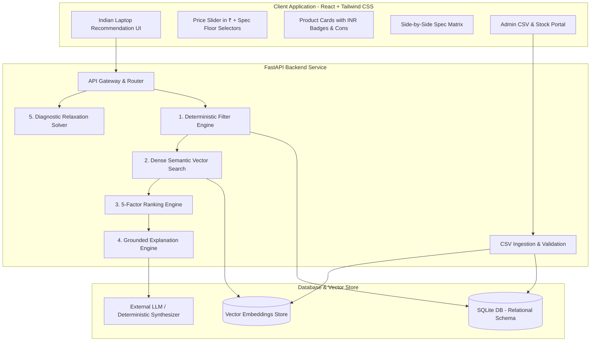

# SmartPick: Software Requirements Specification (SRS) - Indian Market Edition

**Document Version:** 1.0  
**Status:** Approved for Implementation  
**Date:** September 13, 2026  
**System:** SmartPick Product Recommendation Engine (India)  
**Standard:** ISO/IEC/IEEE 29148:2018 & IEEE 830-1998  
**Currency Standard:** Indian Rupee (INR - ₹)  

---

## 1. Introduction

### 1.1 Purpose
This Software Requirements Specification (SRS) establishes the complete technical requirements for the **SmartPick Product Recommendation Engine**, engineered specifically for the **Indian consumer laptop market**.

### 1.2 System Scope
The system ingests, indexes, filters, ranks, and explains laptop recommendations using genuine Indian retail pricing (INR ₹) across 5 primary price brackets:
* **Tier 1 (Budget & Daily):** ₹28,000 – ₹42,000
* **Tier 2 (College Coding & Mainstream):** ₹42,000 – ₹65,000
* **Tier 3 (Budget/Mid Gaming & Creator):** ₹60,000 – ₹85,000
* **Tier 4 (Premium Ultrabook & Executive):** ₹80,000 – ₹1,25,000
* **Tier 5 (Flagship Workstation & Heavy Gaming):** ₹1,25,000 – ₹2,50,000+

It incorporates critical Indian market attributes:
* `ram_expandability`: Soldered vs. open SO-DIMM expansion slots.
* `bundled_software`: MS Office Home & Student Lifetime inclusion.
* `service_network_india`: Tier 1 / Tier 2 city service reach.

---

## 2. System Architecture & Context



---

## 3. Data Models & Database Schemas

### 3.1 Relational Schema (SQLite DDL)

```sql
CREATE TABLE IF NOT EXISTS products (
    id TEXT PRIMARY KEY,
    name TEXT NOT NULL,
    category TEXT NOT NULL DEFAULT 'laptop',
    brand TEXT NOT NULL,
    price REAL NOT NULL CHECK(price > 0),             -- Price in INR (₹)
    ram_gb INTEGER NOT NULL CHECK(ram_gb > 0),
    storage_gb INTEGER NOT NULL CHECK(storage_gb > 0),
    processor TEXT NOT NULL,
    gpu TEXT NOT NULL,
    battery_hours REAL NOT NULL CHECK(battery_hours >= 0),
    weight_kg REAL NOT NULL CHECK(weight_kg >= 0),
    rating REAL NOT NULL DEFAULT 4.0 CHECK(rating >= 1.0 AND rating <= 5.0),
    ram_expandability TEXT NOT NULL DEFAULT 'Soldered', -- 'Soldered', '1 Slot Free (Up to 32GB)', 'Dual Slot Upgradable'
    bundled_software TEXT NOT NULL DEFAULT 'None',     -- 'MS Office Home & Student 2021', 'None'
    display_tech TEXT NOT NULL DEFAULT 'FHD IPS Anti-Glare',
    description TEXT NOT NULL,
    pros TEXT NOT NULL,                                -- JSON string or semicolon-separated
    cons TEXT NOT NULL,                                -- JSON string or semicolon-separated
    in_stock BOOLEAN NOT NULL DEFAULT 1,
    source TEXT NOT NULL DEFAULT 'laptops_india_catalog.csv',
    catalog_updated_at TIMESTAMP DEFAULT CURRENT_TIMESTAMP,
    created_at TIMESTAMP DEFAULT CURRENT_TIMESTAMP,
    updated_at TIMESTAMP DEFAULT CURRENT_TIMESTAMP
);

CREATE TABLE IF NOT EXISTS recommendations (
    id TEXT PRIMARY KEY,
    user_id TEXT,
    request_json TEXT NOT NULL,
    result_json TEXT NOT NULL,
    latency_ms REAL NOT NULL,
    created_at TIMESTAMP DEFAULT CURRENT_TIMESTAMP
);

CREATE TABLE IF NOT EXISTS feedback (
    id TEXT PRIMARY KEY,
    recommendation_id TEXT NOT NULL,
    rating INTEGER NOT NULL CHECK(rating IN (-1, 1)),
    comment TEXT,
    created_at TIMESTAMP DEFAULT CURRENT_TIMESTAMP,
    FOREIGN KEY (recommendation_id) REFERENCES recommendations(id) ON DELETE CASCADE
);

CREATE INDEX IF NOT EXISTS idx_products_filter 
ON products (category, in_stock, price, ram_gb, storage_gb);
```

---

## 4. API Endpoints & Payload Specifications

### 4.1 POST `/api/recommend`

#### Request Payload
```json
{
  "category": "laptop",
  "max_budget": 75000,
  "min_ram_gb": 16,
  "min_storage_gb": 512,
  "use_case": "Engineering college student, programming in Python and C++, runs Docker and occasional Valorant gaming, needs good battery and cooling",
  "brand": null,
  "priority": "value"
}
```

#### Success Response (HTTP 200 OK)
```json
{
  "status": "success",
  "request_id": "rec_ind_01",
  "catalog_updated_at": "2026-09-13T10:00:00Z",
  "currency": "INR",
  "total_eligible_count": 6,
  "recommendations": [
    {
      "product_id": "lap_loq_13450hx",
      "name": "Lenovo LOQ 15IRH8",
      "brand": "Lenovo",
      "price": 67990.0,
      "formatted_price": "₹67,990",
      "match_score": 94,
      "specs": {
        "ram_gb": 16,
        "storage_gb": 512,
        "processor": "Intel Core i5-13450HX",
        "gpu": "NVIDIA GeForce RTX 3050 6GB GDDR6",
        "battery_hours": 6.0,
        "weight_kg": 2.4,
        "rating": 4.5,
        "ram_expandability": "Dual Slot Upgradable (Up to 32GB)",
        "bundled_software": "MS Office Home & Student 2021"
      },
      "reasons": [
        "Well within your ₹75,000 budget, priced at ₹67,990 (saving ₹7,010)",
        "Powerful Intel Core i5-13450HX with RTX 3050 handles both Docker compilation and Valorant effortlessly",
        "Includes Lifetime MS Office Home & Student 2021 saving ₹8,000",
        "Features dual-slot RAM expandability up to 32GB for long-term engineering coursework"
      ],
      "limitations": [
        "Heavier at 2.4 kg and battery life is ~5-6 hours under normal load"
      ],
      "evidence": [
        { "attribute": "price", "value": "₹67,990", "source": "laptops_india_catalog.csv" },
        { "attribute": "ram_expandability", "value": "Dual Slot Upgradable", "source": "laptops_india_catalog.csv" },
        { "attribute": "bundled_software", "value": "MS Office Home & Student 2021", "source": "laptops_india_catalog.csv" }
      ]
    }
  ]
}
```

#### No-Match Response (HTTP 200 OK)
```json
{
  "status": "no_match",
  "request_id": "rec_ind_02",
  "currency": "INR",
  "message": "No laptops in our Indian catalog satisfy all your mandatory requirements.",
  "unmet_filters": [
    {
      "filter": "max_budget",
      "requested_value": "₹35,000",
      "minimum_price_for_spec": "₹51,990 (HP 15s with 16GB RAM)"
    }
  ],
  "possible_adjustments": [
    "Reduce minimum RAM to 8 GB (available from ₹29,990)",
    "Increase your maximum budget to at least ₹51,990 for 16 GB RAM"
  ]
}
```

---

## 5. Algorithmic Specifications

### 5.1 Deterministic Pre-Filtering
$$\mathcal{C} = \{ p \in \mathcal{P} \mid p.\text{price} \le \text{Budget}_{\text{INR}} \land p.\text{ram\_gb} \ge \text{MinRAM} \land p.\text{storage\_gb} \ge \text{MinSSD} \land p.\text{in\_stock} = \text{True} \}$$
Guarantees **100% precision** against mandatory constraints.

### 5.2 5-Factor Ranking Model
$$S_{\text{final}}(p) = 0.35 \cdot S_{\text{req}}(p) + 0.25 \cdot S_{\text{sem}}(p) + 0.20 \cdot S_{\text{prio}}(p) + 0.10 \cdot S_{\text{rat}}(p) + 0.10 \cdot S_{\text{val}}(p)$$

* **$S_{\text{val}}(p)$ (Value for Money in Indian Market):**
  $$\text{SpecScore}(p) = 0.3 \cdot \frac{p.\text{ram\_gb}}{16} + 0.3 \cdot \frac{p.\text{storage\_gb}}{512} + 0.2 \cdot \frac{p.\text{battery}}{8} + 0.2 \cdot (\text{GPU Tier Score})$$
  $$\text{ValueRatio} = \frac{\text{SpecScore}(p)}{p.\text{price} / 10000}$$
  Normalized to scale $[0, 100]$.

---

## 6. 20 Golden Indian Market Benchmark Personas

The QA suite evaluates the following 20 representative Indian buyer scenarios:

| # | Persona | Use Case Prompt | Budget (₹) | Min RAM | Min SSD | Expected Ideal Model |
| :-: | :--- | :--- | :---: | :---: | :---: | :--- |
| 1 | CS Undergrad (Tier-2 College) | Python, VS Code, Git, Docker, needs upgradable RAM | ₹65,000 | 16 GB | 512 GB | Lenovo IdeaPad Slim 5 / Acer Swift Go 14 |
| 2 | Casual Gamer + Engineering | Valorant, GTA V, AutoCAD, decent cooling | ₹75,000 | 16 GB | 512 GB | Lenovo LOQ 15 / ASUS TUF Gaming A15 |
| 3 | UPSC / CA Aspirant | Reading 1000-page PDFs in library, 12+ hr battery, eye comfort | ₹55,000 | 8 GB | 512 GB | ASUS Vivobook 15 Anti-Glare / HP 15s |
| 4 | Corporate IT Consultant | Heavy Zoom/Teams, travel to client sites, sleek & light < 1.3kg | ₹95,000 | 16 GB | 512 GB | ASUS Zenbook 14 OLED / Apple MacBook Air M2 |
| 5 | Wedding & YouTube Video Editor | Premiere Pro, DaVinci, 4K rendering, 100% sRGB/DCI-P3 | ₹1,15,000 | 16 GB | 1 TB | Acer Nitro V 16 / ASUS Vivobook Pro 15 OLED |
| 6 | Machine Learning Student | PyTorch, CUDA, local fine-tuning, discrete NVIDIA GPU | ₹1,25,000 | 32 GB | 1 TB | Lenovo Legion Pro 5i / ASUS ROG Strix G16 |
| 7 | Tight Budget School Student | Homework, browsing, YouTube, MS Word | ₹35,000 | 8 GB | 512 GB | Acer Aspire Lite / Lenovo IdeaPad Slim 3 |
| 8 | General Home & Small Business | Tally ERP, MS Excel, billing, durable keyboard | ₹45,000 | 16 GB | 512 GB | HP 15s / Dell 15 |
| 9 | Apple Ecosystem Aspirant | Best student Mac on a budget, long battery, Xcode | ₹70,000 | 8 GB | 256 GB | Apple MacBook Air M1 (Legendary value) |
| 10 | Premium Executive Road Warrior | Premium metal build, 18hr battery, fast wake | ₹1,35,000 | 16 GB | 512 GB | Apple MacBook Air 15 M3 / Dell XPS 13 |
| 11 | Competitive Esports Gamer | CS2, Apex Legends, 144Hz screen, high TDP | ₹90,000 | 16 GB | 512 GB | Acer Predator Helios Neo 16 / HP Omen 16 |
| 12 | Architecture Student | Revit, 3ds Max, Lumion, needs high VRAM | ₹1,10,000 | 16 GB | 1 TB | ASUS TUF Gaming F15 (RTX 4060) |
| 13 | Content Writer / Freelancer | Great keyboard, silent fanless operation, portable | ₹60,000 | 8 GB | 512 GB | Apple MacBook Air M1 / ASUS Zenbook |
| 14 | Linux Enthusiast / SysAdmin | 100% Linux hardware support, rugged chassis | ₹85,000 | 16 GB | 512 GB | Lenovo ThinkPad E14 / E16 |
| 15 | Music Producer / FL Studio | Low DPC latency, 1TB SSD, 16GB RAM | ₹1,00,000 | 16 GB | 1 TB | Apple MacBook Air M2 / Lenovo IdeaPad Pro 5 |
| 16 | Medical Professional | Hospital rounds, lightweight, wipeable chassis | ₹75,000 | 16 GB | 512 GB | Samsung Galaxy Book 4 / HP Pavilion Aero 13 |
| 17 | GATE Computer Science Aspirant | C, Data structures, PDF annotating, low noise | ₹50,000 | 16 GB | 512 GB | ASUS Vivobook 16 (Ryzen 5) |
| 18 | Data Analyst / PowerBI | PowerBI, heavy SQL, dual monitor support | ₹80,000 | 16 GB | 512 GB | Lenovo IdeaPad Slim 5 (Core Ultra 5) |
| 19 | Impossible Budget Boundary (Zero-Match) | 32GB RAM, RTX 4070 under ₹40,000 | ₹40,000 | 32 GB | 1 TB | Triggers no-match diagnostic with relaxation guidance |
| 20 | Stock Outage Invariant | Discontinued or out-of-stock model | ₹70,000 | 16 GB | 512 GB | Verifies out-of-stock laptop is never recommended |
